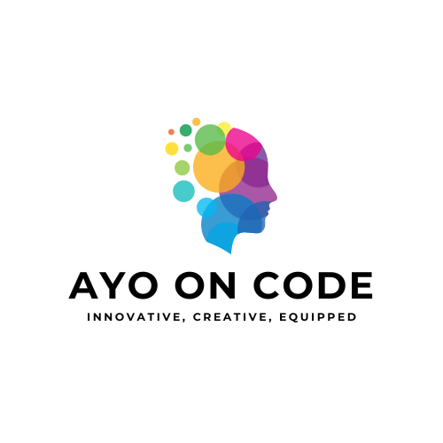

<div align="center">
  
  <br/>

  <h1><b>Welcome to my project 😃</b></h1>
</div>

<div align="center">
  
  <br/>
<h1 align="center">LeaderBoard Website</h1>
</div>

# 📗 Table of Contents

- [📖 About the Project](#about-project)
  - [🛠 Built With](#built-with)
    - [Tech Stack](#tech-stack)
    - [Key Features](#key-features)
- [💻 Getting Started](#getting-started)

  - [Setup](#setup)
  - [Prerequisites](#prerequisites)
  - [Install](#install)
  - [Usage](#usage)

- [🚀 Live Demo](#live-demo)
- [👥 Authors](#authors)
- [🤝 Contributing](#contributing)
- [⭐️ Show your support](#support)
- [🙏 Acknowledgements](#acknowledgements)
- [📝 License](#license)

# 📖 <a name="about-project">[LEADERBOARD WEBSITE]</a>

The leaderboard website displays scores submitted by different players. It also allows you to submit your score. I used HTML, CSS and Javascript programming languages in the creation of this project.

## 🛠 Built With <a name="built-with"></a>

### Tech Stack <a name="tech-stack"></a>

<details>
  <summary>Client</summary>
  <ul>
    <li><a href="https://html.com/">HTML</a></li>
    <li><a href="https://www.css3.com/">CSS</a></li>
    <li><a href="https://www.javascript.com/">JavaScript</a></li>

  </ul>
</details>

### Key Features <a name="key-features"></a>

- **Functionality: the Leaderboard API was created using JavaScript async and await**
<!-- - **List: A clicakable link on the navigation bar that displays the books inputted by the user**
- **Add New:A clickable link that displays a form allowing users to input the title and author of books**
- **Social Contact: A form allowing visitors to get in touch with me.** -->
- **Responsive Design: The website is optimized for different devices and screen sizes.**

<!-- <p align="right">(<a href="#readme-top">back to top</a>)</p> -->

<!-- ## 🚀 Live Demo <a name="live-demo"></a> -->

<!-- - [Live Demo Link](https://ayokunnumi1.github.io/Awesome-Books/) -->

<p align="right">(<a href="#readme-top">back to top</a>)</p>

## 💻 Getting Started <a name="getting-started"></a>

To get a local copy up and running, follow these steps.

### Prerequisites

In order to run this project you need:

1. A code editor or an IDE installed on your computer (e.g., Visual Studio Code, Sublime Text, Atom).
2. Git installed on your system to clone the repository.
3. A web browser to view and test the project.

### Setup

1. Open your preferred terminal or command prompt.
2. Navigate to the directory where you want to clone the project.

Run this command;

```sh
  cd my-folder
  git@github.com:Ayokunnumi1/Leaderboard.git
```

### Install

After cloning the repository, navigate into the project's directory. If there are any dependencies required for the project, you need to install them. Typically, this involves using a package manager like npm or yarn.

Run this command;

```sh
  npm install
```

### Usage

1. Open the index.html file in your preferred web browser.
2. Explore the different sections of the website.
3. Customize the content and design to match your own portfolio by modifying the HTML, CSS & JavaScript files.

<p align="right">(<a href="#readme-top">back to top</a>)</p>

## 👥 Author <a name="authors"></a>

👤**Ayokunnumi Omololu**

- GitHub: [@Ayokunnumi1][https://github.com/Ayokunnumi1]
- Twitter: [@Ayokunnumi1] [https://twitter.com/AyokunnumiA]
- LinkedIn: [Ayokunnumi] [https://www.linkedin.com/in/ayokunnumiomololu]

 <p align="right">(<a href="#readme-top">back to top</a>)</p>

## 🔭 Future Features <a name="future-features"></a>

- [ ] **Project Showcase**
- [ ] **Interactive sections**

<p align="right">(<a href="#readme-top">back to top</a>)</p>

## 🤝 Contributing <a name="contributing"></a>

Contributions, issues, and feature requests are welcome!

Feel free to check the [issues page](https://github.com/Ayokunnumi1/Portfolio-setup-and-mobile-first/issues).

<p align="right">(<a href="#readme-top">back to top</a>)</p>

## ⭐️ Show your support <a name="support"></a>

If you like this project. show your support by following my github account.

<p align="right">(<a href="#readme-top">back to top</a>)</p>

## 🙏 Acknowledgments <a name="acknowledgements"></a>

I appreciate Microverse for creating this project.

<p align="right">(<a href="#readme-top">back to top</a>)</p>

## 📝 License <a name="license"></a>

This project is [MIT](/LICENSE) licensed.

<p align="right">(<a href="#readme-top">back to top</a>)</p>
